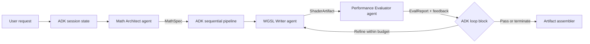
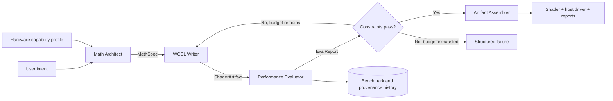
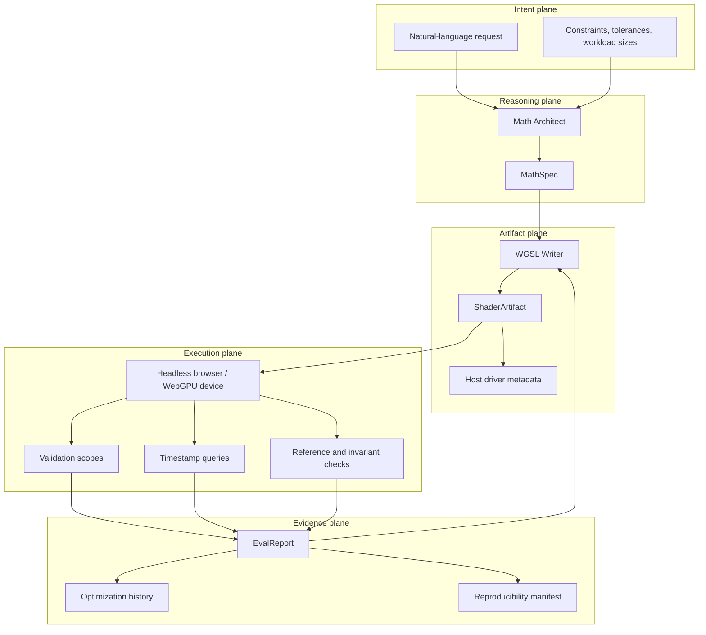
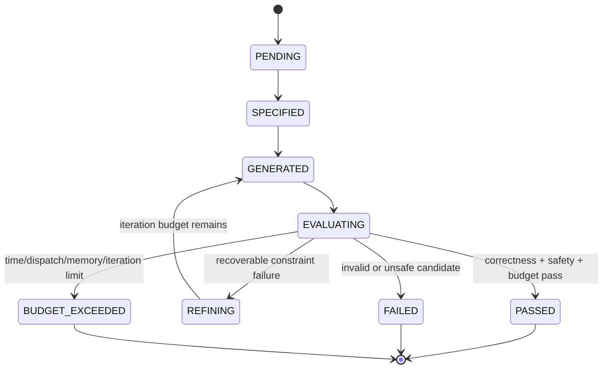
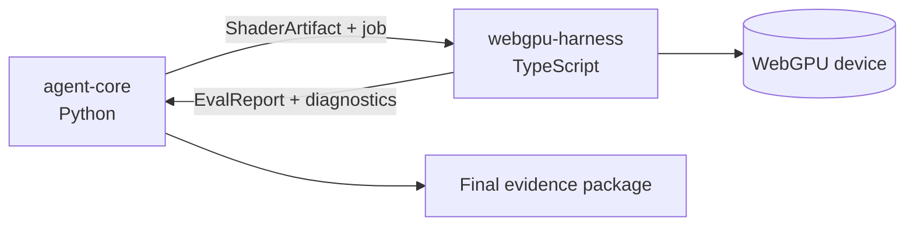
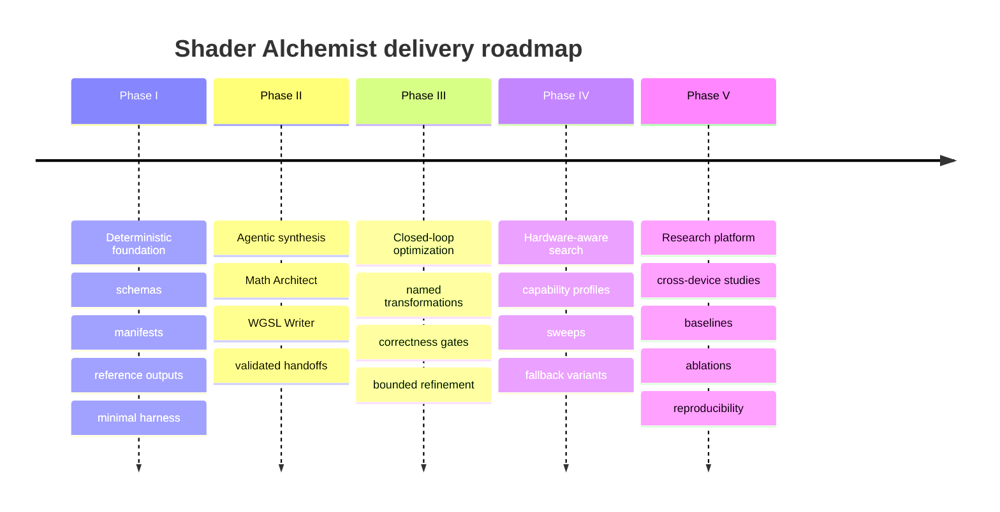

# ⚗️ Shader Alchemist

> **A Google Agent Development Kit (ADK) project for evidence-driven generation and optimization
> of verified WebGPU compute shaders.**

[](#project-status)
[](#google-adk-project)
[](#what-it-does)
[](#repository-layout)

Shader Alchemist is an **agentic ADK application**, not a standalone shader generator. It turns
an algorithmic or visual request into a structured mathematical contract, a candidate WGSL
compute shader, and a measured evidence package. It is deliberately not a one-shot code generator:
source is treated as a hypothesis, while correctness and performance are established through
schemas, validation, isolated execution, reference comparisons, and repeatable benchmarks.

## Project status

This repository contains the implementation-oriented project structure, schemas, agent modules,
WebGPU harness, examples, templates, and CI scaffolding. The design documents remain the
authoritative description of the research roadmap and future capabilities. Requirements are
tracked in [`REQUIREMENTS.md`](./REQUIREMENTS.md).

## Google ADK project

Shader Alchemist uses Google's **Agent Development Kit (ADK)** as the orchestration model for its
multi-agent workflow. The ADK layer coordinates specialized agents, shared typed state, tools,
sequential execution, and bounded iterative refinement:



The ADK responsibilities are:

| ADK concept | Shader Alchemist use |
| --- | --- |
| **Agent** | Math Architect, WGSL Writer, and Performance Evaluator roles |
| **Shared/session state** | User request, capability profile, `MathSpec`, artifacts, reports, and iteration history |
| **Sequential orchestration** | Math planning → shader synthesis → evaluation → packaging |
| **Loop orchestration** | Re-run synthesis with evaluator feedback until constraints pass or the budget is exhausted |
| **Tool invocation** | Static analysis, WebGPU execution, timestamp profiling, validation, and report generation |
| **Structured output** | Pydantic-backed contracts for state, specifications, artifacts, and evaluation reports |

The Python dependencies for the ADK agent runtime are listed in
[`requirements.txt`](./requirements.txt). The TypeScript WebGPU harness is a separate execution
boundary used by the ADK evaluator tools; it is not a replacement for the ADK agent layer.

## What it does



The central loop is:

```text
intent → specification → synthesis → execution → measurement → refinement
```

### The three core roles

| Role | Produces | Main responsibility |
| --- | --- | --- |
| **Math Architect ADK agent** | `MathSpec` | Formalize equations, decomposition, memory layout, bindings, synchronization, and invariants. |
| **WGSL Writer ADK agent** | `ShaderArtifact` | Generate valid WGSL plus the host-side pipeline and dispatch contract. |
| **Performance Evaluator ADK agent** | `EvalReport` | Invoke tools to compile, validate, execute, compare, measure, diagnose, and feed back evidence. |

## Why this architecture?

GPU programs fail in ways that are not visible from source inspection alone. A shader can be
syntactically valid but still have a binding mismatch, an invalid dispatch geometry, a race,
an alignment error, numerical drift, or poor performance on a particular device.

Shader Alchemist therefore keeps these concerns separate:

1. **Specification before synthesis** — create a machine-checkable contract before writing WGSL.
2. **Source is not evidence** — separate compiler, API, memory, numerical, semantic, and timing
   results.
3. **Optimization is experimental** — compare named transformations under the same manifest.
4. **Hardware is first-class state** — optional features and device limits drive variant selection.
5. **Correctness precedes ranking** — a fast invalid candidate is never an acceptable winner.

## Architecture at a glance



## State-driven refinement

Every candidate moves through an explicit lifecycle. This makes failed experiments explainable
and enables replay rather than hiding changes inside an opaque agent prompt.



## Contract objects

### `MathSpec`

The mathematical contract describes:

- algorithm and domain;
- workgroup and derived dispatch geometry;
- buffers, strides, offsets, padding, and bindings;
- synchronization and pass boundaries;
- numerical precision and tolerances;
- required capabilities;
- invariants and verification obligations.

### `ShaderArtifact`

The executable hypothesis includes WGSL source **and** its entry points, resource layout,
dispatch configuration, feature requirements, and provenance. WGSL without its host contract is
not a complete artifact.

### `EvalReport`

The evidence record includes validation outcomes, timing samples and percentiles, correctness
comparisons, memory/resource observations, numerical error, optimization observations, and
remediation advice.

## Repository layout

```text
shader-alchemist/
├── packages/
│   ├── agent-core/                 # Google ADK agents, schemas, pipeline, tools, code generation
│   │   ├── src/shader_alchemist/
│   │   │   ├── agents/             # Math Architect, WGSL Writer, Evaluator
│   │   │   ├── codegen/            # Host driver and report generation
│   │   │   ├── pipeline/           # ADK sequential orchestration and refinement loop
│   │   │   ├── schemas/            # State, MathSpec, artifact, and EvalReport contracts
│   │   │   └── tools/              # Profiler and static-analysis integrations
│   │   └── src/tests/              # Agent and pipeline tests
│   └── webgpu-harness/             # TypeScript execution and profiling boundary
│       ├── src/                    # Browser runner, device setup, timing, validation
│       └── tests/                  # Harness and timestamp-query tests
├── docs/
│   ├── architecture/               # Topology, state machine, and alignment rules
│   ├── examples/                   # Spatial hashing and SPH examples
│   └── api-reference.md            # API and contract notes
├── templates/                      # Generated TypeScript/WebGPU project templates
├── scripts/                        # Environment, harness, and benchmark utilities
├── .github/workflows/              # CI and benchmark automation
├── REQUIREMENTS.md                 # Functional, non-functional, and acceptance requirements
├── requirements.txt                # Python ADK agent-runtime dependencies
└── README.md
```

The Python and TypeScript halves are intentionally separate:



## Safety and reproducibility

Generated shaders are executable programs. The evaluator must assume that a candidate can contain
an oversized dispatch, an excessively long loop, large allocations, invalid resources, or a
driver-stressing workload. The harness therefore uses:

- dispatch, allocation, loop, and wall-clock limits;
- watchdogs and cancellation;
- disposable browser/device contexts;
- failure quarantine and last-known-good rollback;
- explicit failure reports instead of silent source rewrites.

Every benchmark should preserve an experiment identity:

```text
(shader hash, MathSpec hash, hardware hash, input hash, configuration hash, timestamp)
```

Warm-up iterations and measured iterations are recorded separately. Results from unlike devices,
drivers, browsers, or measurement modes must not be treated as direct regression comparisons.

## Correctness model

Shader Alchemist reports correctness as several independent layers:

| Layer | Example evidence |
| --- | --- |
| Source/compiler | WGSL parsing and compilation |
| WebGPU validation | Pipeline, bind-group, feature, and resource validation |
| Memory | Bounds, allocation, alignment, and access checks |
| Numerical | Absolute/relative error against a reference |
| Deterministic/parallel | Repeatability and race-sensitive checks |
| Semantic | Domain invariants and expected output behavior |

For floating-point workloads, reports should retain both absolute and relative tolerances and the
aggregation rule. For discrete workloads, exact equality may be required.

## Optimization strategy

Optimization is a search over valid candidates, not a request for shorter code. Candidate
transformations may include:

- workgroup-size sweeps;
- array-of-structures/structure-of-arrays conversion;
- workgroup-memory tiling;
- loop or branch restructuring;
- multi-pass decomposition;
- atomics and subgroup operations when supported;
- FP16 or mixed precision under an explicit tolerance;
- specialization and dispatch decomposition.

Hard correctness, resource, and portability requirements define the feasible set first. Only then
are latency, memory, energy, complexity, and portability used to rank candidates or form a Pareto
frontier.

## Example workload

Spatial hashing illustrates the complete flow:

1. derive a cell index from particle position;
2. calculate a deterministic hash;
3. define an explicitly padded particle layout;
4. choose workgroup and dispatch dimensions;
5. identify barriers or multi-pass requirements;
6. generate WGSL and a host binding contract;
7. validate bounds and compare results with a reference;
8. benchmark alternate workgroup sizes and layouts.

See [`docs/examples/spatial-hash-3d.md`](./docs/examples/spatial-hash-3d.md) and
[`docs/examples/sph-fluid-sim.md`](./docs/examples/sph-fluid-sim.md).

## Documentation map

| Document | Use it for |
| --- | --- |
| [`REQUIREMENTS.md`](./REQUIREMENTS.md) | Normative functional, safety, data-contract, and acceptance requirements |
| [`docs/api-reference.md`](./docs/api-reference.md) | API and integration notes |
| [`docs/architecture/system-topology.png`](./docs/architecture/system-topology.png) | Visual system topology |
| [`docs/architecture/state-machine.md`](./docs/architecture/state-machine.md) | Candidate lifecycle |
| [`docs/architecture/memory-alignment-rules.md`](./docs/architecture/memory-alignment-rules.md) | Layout and alignment guidance |
| [`docs/examples/spatial-hash-3d.md`](./docs/examples/spatial-hash-3d.md) | Worked spatial-hashing workload |
| [`docs/examples/sph-fluid-sim.md`](./docs/examples/sph-fluid-sim.md) | Worked fluid-simulation workload |
| [`docs/DocsForAgentsToRead/shader_alchemist_documentation.tex`](./docs/DocsForAgentsToRead/shader_alchemist_documentation.tex) | Full research proposal and system design |
| [`docs/DocsForAgentsToRead/chat.txt`](./docs/DocsForAgentsToRead/chat.txt) | Expanded architecture discussion and implementation blueprint |

## Roadmap



## Design principles

1. **Measure before claiming.** Performance is empirical and workload/device specific.
2. **Make contracts explicit.** Bindings, layouts, dispatch, and tolerances are data.
3. **Keep evidence with the artifact.** A shader without diagnostics and provenance is incomplete.
4. **Prefer bounded automation.** Every loop, allocation, and benchmark sweep has a limit.
5. **Separate concerns.** Agent reasoning, generated artifacts, and execution are independently
   testable.
6. **Optimize only feasible candidates.** Invalid or unsafe code cannot win on speed.

## Contributing

When adding a workload, include its mathematical domain, reference implementation or oracle,
buffer and binding contract, dispatch derivation, tolerances, invariants, benchmark manifest, and
failure expectations. When adding an optimization, give it a name, state the target bottleneck,
record its risks, and compare it under unchanged benchmark conditions.

Keep Python agent-core changes independently testable from TypeScript harness changes. Update
[`REQUIREMENTS.md`](./REQUIREMENTS.md) when a behavior or contract changes.

## License

See [`LICENSE`](./LICENSE).